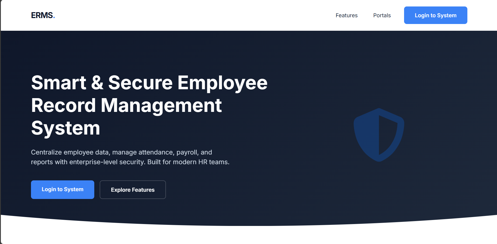
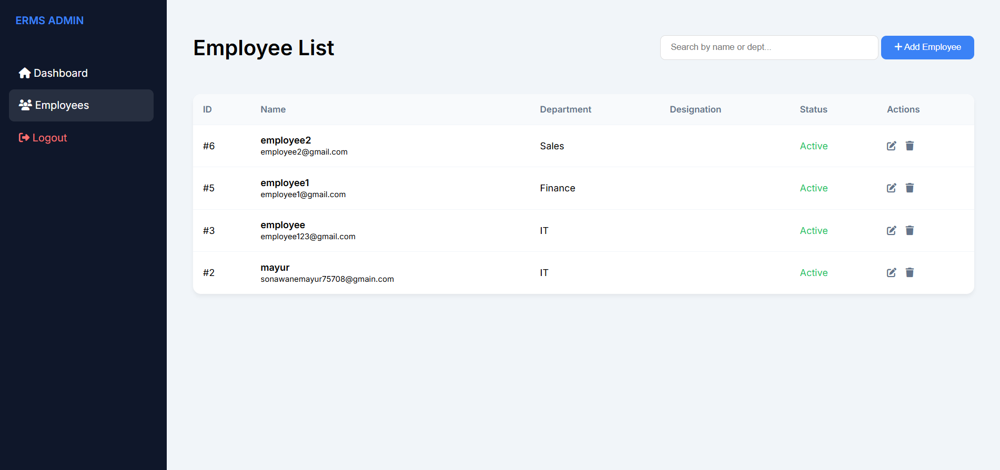
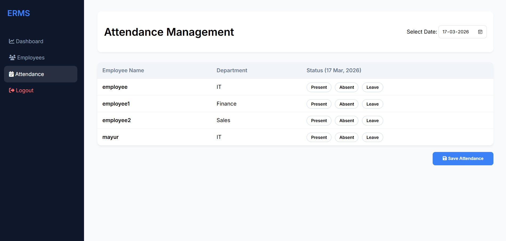
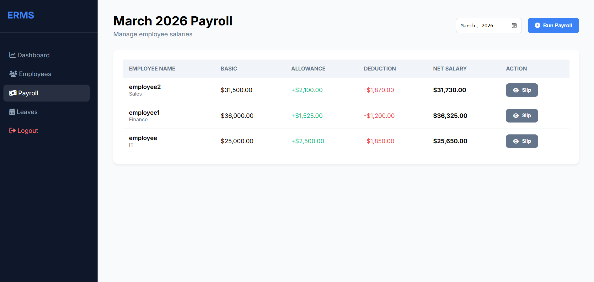
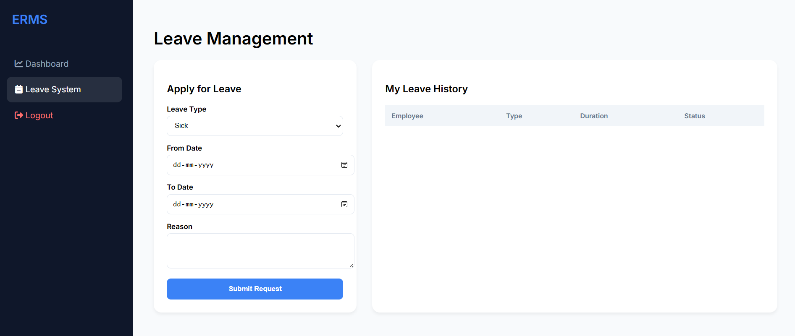
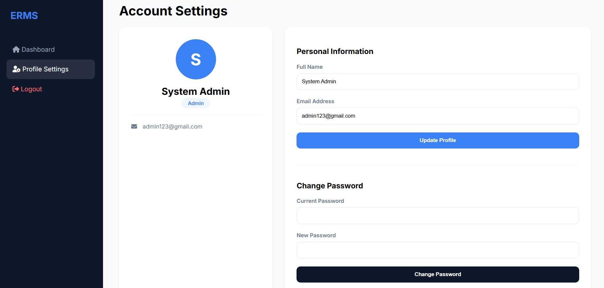

# 🚀 Employee Record Management System (ERMS)

<div align="center">

### Enterprise HR Management Solution Built with PHP & MySQL


**A complete Human Resource Management System for managing employees, attendance, payroll, departments, leave requests, and organizational records.**

</div>

---

# 📌 Live Preview

### 🌐 Project Repository

[GitHub Repository](YOUR_GITHUB_REPOSITORY_LINK)

### 📷 Application Screenshots

#### Main Page



#### Dashboard


#### Employee Management



#### Attendance Module



#### Payroll Module



#### Leave Managment Page



#### Profile Setting



---

# 📑 Table of Contents

* Overview
* Features
* System Modules
* Technology Stack
* Project Structure
* Installation Guide
* Screenshots
* Database Design
* Future Enhancements
* Learning Outcomes
* Author

---

# 📖 Overview

Employee Record Management System (ERMS) is a web-based Human Resource Management platform developed using PHP and MySQL.

The system centralizes employee information, attendance records, payroll processing, leave requests, department management, and reporting functionalities into a single platform.

The application is designed to improve organizational efficiency through automation and structured workforce management.

---

# ✨ Key Features

## 🔐 Authentication & Security

* Secure Login System
* Session Management
* Role-Based Access Control
* Protected Routes
* User Authentication

## 👨‍💼 Employee Management

* Add Employees
* Update Employee Records
* Delete Employee Profiles
* Search Employee Information
* Employee Status Tracking

## 🏢 Department Management

* Create Departments
* Manage Department Records
* Update Department Information

## ⏰ Attendance Management

* Attendance Recording
* Attendance Monitoring
* Attendance Reports

## 📄 Leave Management

* Leave Request Processing
* Leave Approval Workflow
* Leave History Tracking

## 💰 Payroll Management

* Salary Management
* Payroll Processing
* Payroll Reports

## 📁 Document Management

* Employee Document Storage
* File Tracking
* Document Administration

## 📊 Reports & Analytics

* Workforce Overview
* Employee Statistics
* Organizational Reports
* Dashboard Insights

---

# 🏗️ System Modules

| Module                    | Description                        |
| ------------------------- | ---------------------------------- |
| 🔐 Authentication         | User login and access control      |
| 👨‍💼 Employee Management | Complete employee CRUD operations  |
| 🏢 Departments            | Department administration          |
| ⏰ Attendance              | Attendance tracking and monitoring |
| 📄 Leave Management       | Leave application workflow         |
| 💰 Payroll                | Salary and payroll management      |
| 📁 Documents              | Employee document repository       |
| 📊 Reports                | Analytics and reporting dashboard  |

---

# 🛠️ Technology Stack

## Frontend

* HTML5
* CSS3
* Bootstrap 5
* JavaScript
* Font Awesome
* Google Fonts

## Backend

* PHP

## Database

* MySQL

## Server

* Apache
* XAMPP

---

# 📂 Project Structure

```bash
Employee_Record_Management_System/
│
├── authenticate.php
├── dashboard.php
├── login.php
├── logout.php
│
├── manage_employees.php
├── manage_departments.php
├── manage_attendance.php
├── manage_leaves.php
├── manage_payroll.php
├── manage_documents.php
│
├── process_employee.php
├── process_dept.php
├── process_attendance.php
├── process_leave.php
├── process_payroll.php
├── process_document.php
│
├── profile_settings.php
└── reports.php
```

---

# ⚙️ Installation Guide

## 1️⃣ Clone Repository

```bash
git clone https://github.com/YOUR_USERNAME/employee-record-management-system.git
```

## 2️⃣ Move Project Folder

```text
xampp/htdocs/
```

## 3️⃣ Start XAMPP Services

* Apache
* MySQL

## 4️⃣ Create Database

```sql
CREATE DATABASE employee_mgmt;
```

## 5️⃣ Import SQL File

Import:

```text
employee_mgmt.sql
```

using phpMyAdmin.

## 6️⃣ Configure Database

```php
$conn = new mysqli(
    "localhost",
    "root",
    "",
    "employee_mgmt"
);
```

## 7️⃣ Run Application

```text
http://localhost/Employee_Record_Management_System
```

---

# 🗄️ Database Design

### Core Tables

* employees
* departments
* attendance
* payroll
* leaves
* documents
* users

---

# 📈 Future Enhancements

* Email Notifications
* PDF Report Export
* Excel Export
* Employee Self-Service Portal
* REST API Integration
* Cloud Deployment
* Advanced Dashboard Analytics
* Mobile Responsive UI

---

# 🎯 Learning Outcomes

This project demonstrates:

✅ PHP Web Development

✅ MySQL Database Design

✅ CRUD Operations

✅ Session Authentication

✅ Role-Based Access Control

✅ HR Management Workflow

✅ Enterprise Dashboard Development

✅ Database Integration

---

# 👨‍💻 Author

## Virendra Solunke

Aspiring Data Analyst | Business Intelligence Enthusiast | Full Stack Development Learner

### Connect With Me

* LinkedIn: YOUR_LINKEDIN_URL
* GitHub: YOUR_GITHUB_URL

---

# ⭐ Support

If you found this project useful, please consider giving it a ⭐ on GitHub.

---

# 📜 License

This project is developed for educational and portfolio purposes.
